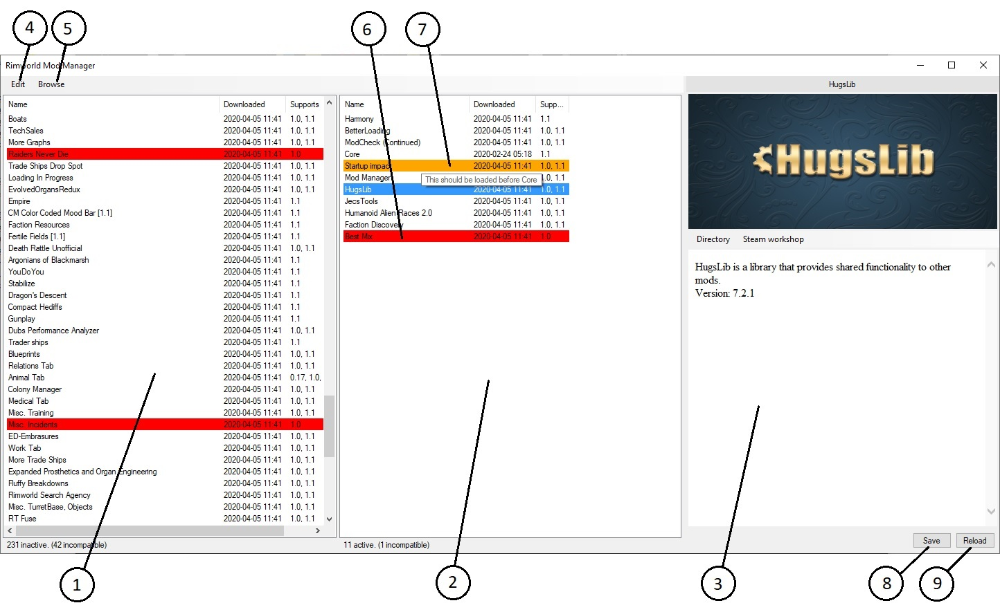

# Rimworld Mod Manager

## Download
Can be downloaded from [releases](https://github.com/Zeracronius/RimworldModManager/releases).

## Description
Originally inspired by ModSorter by Mehni  
https://github.com/Mehni/ModSorter
 
This tool is designed to be very light weight; A single executable file that requires no installation.  
**Currently only supports Windows.**

1. List of inactive mods available.
    - All mods available but not currently active is listed here.
    - Can be sorted by clicking the column headers.
    - Mods can be activated by either double clicking or dragging them into the list on the right. 
    - Multiple mods can be dragged at once.
2. List of enabled/active mods
    - All currently active mods are listed here in the current load order.
    - Load order can be changed using drag and drop inside the list.
    - Similar to the list of inactive mods, mods can be disabled by either double clicking or dragging them back into the inactive list.
    - Multiple mods can be dragged at once.
    - Because the active mods are listed by load order, this list does not support sorting by column.
3. Information about the selected mod.
    - The 'Directory' button opens the mod's local folder in a file browser.
    - The 'Steam Workshop' button is only visible for steam-workshop mods, and attempts to open the mod's workshop page in steam.
4. Edit button.
    - Modify configurations.
    - Export active mods as a mod list file.
    - Import active mods from a rimworld save or an exported mod list.
5. Browse button.
    - Provides shortcuts to open various related folders in windows.
6. Incompatible or missing mods.
    - Mods that are incompatible with the current game version - or completely missing - will show up as red.
7. Warnings about load order mod dependancies.
    - Hover over the highlighted mod to see details about the issue(s).
8. Save button.
    - overwrites rimworld's mod list config with the new list as defined in the program.  
9. Reload button.
    - rediscovers mods from mod folders, and reloads the current active mods from the rimworld configuration file.  

Contains basic auto-sorting.

Rimsort is a much more powerful alternative that does support auto-sorting the load order.  
https://github.com/RimSort/RimSort/releases

## Credits:
Uses TreeListView as a base.  
https://objectlistview.sourceforge.net
